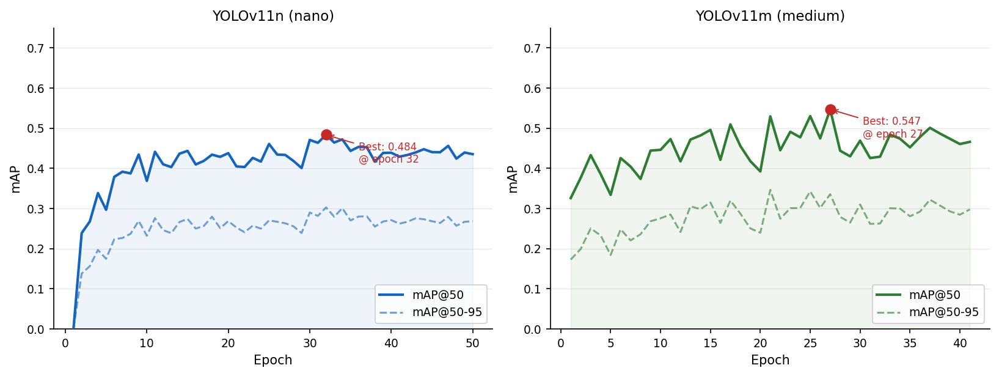
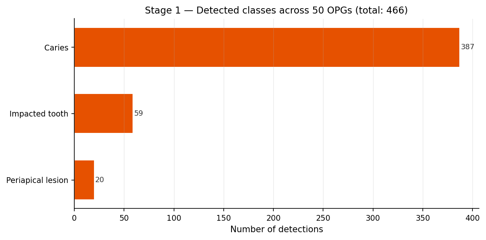
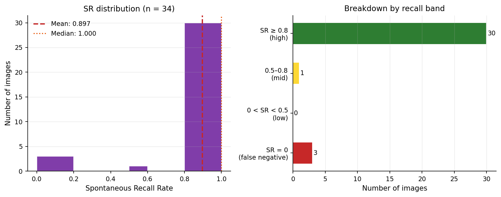
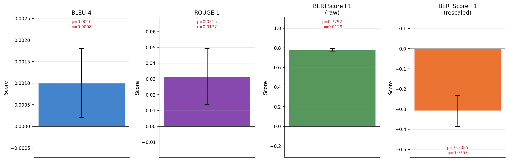
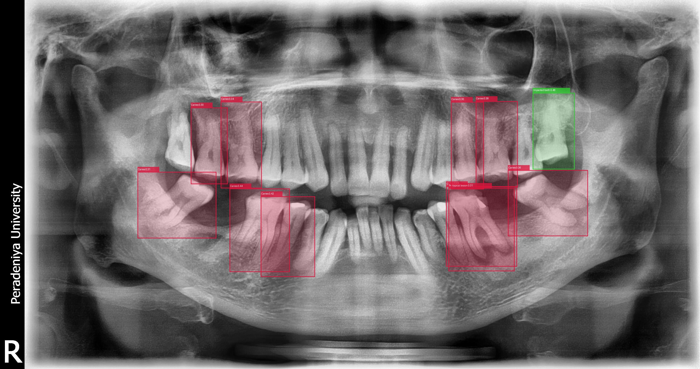
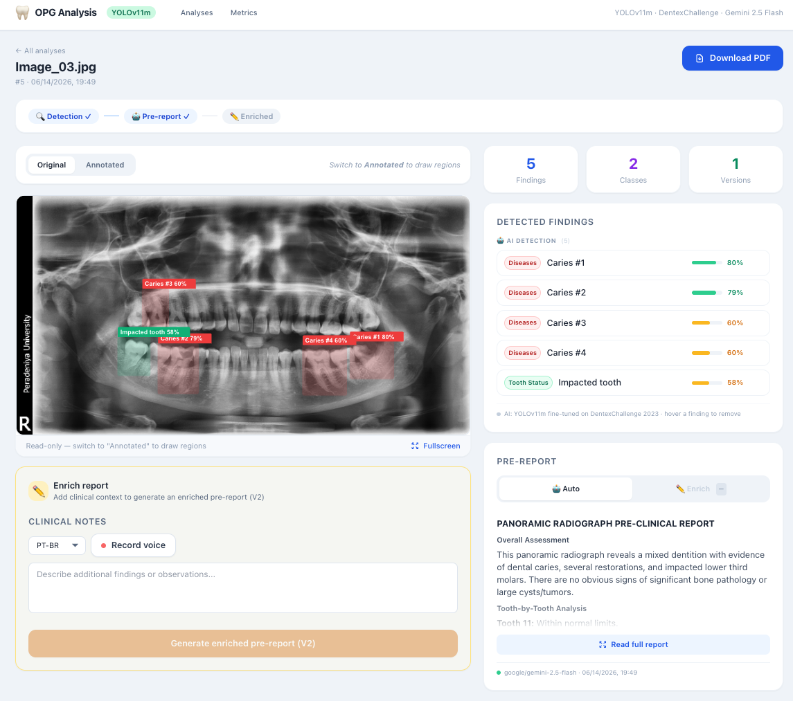

# Automated Dental Pathology Detection in Panoramic Radiographs

> **Paper submitted to [CBEB 2026](https://sbeb.org.br/cbeb2026/), the Brazilian Congress on Biomedical Engineering**
> *Transfer Learning for Dental Pathology Detection in Panoramic Radiographs: YOLOv11 vs. Zero-Shot Grounding DINO*
> Ernane Ferreira Rocha Junior, Ignacio Sanchez-Gendriz, Luiz Affonso Guedes (UFRN / CETENE); Yoandris González Sánchez (Fundación Odontológica Social Luis Seiquer, Seville, Spain)
>
> **[Read the full paper (PDF)](paper.pdf)**

Research code accompanying the paper above. A three-stage pipeline applied to orthopantomographs (OPGs):

1. **Stage 1: Detection.** YOLOv11m, fine-tuned on DentexChallenge 2023, detects caries, periapical lesions, and impacted teeth.
2. **Stage 2: Spontaneous recall.** Detected classes are compared against dentist-written descriptions, without prompt injection.
3. **Stage 3: Report generation.** Gemini 2.5 Flash produces a structured pre-clinical report from the detected findings.

A React and FastAPI web application wraps the full pipeline for interactive use.

---

## Requirements

- Python 3.10+
- Node.js 18+
- `OPENROUTER_API_KEY` for Stage 3 (get one at [openrouter.ai](https://openrouter.ai))
- ~12 GB free disk space if training from scratch (DentexChallenge dataset)
- Apple Silicon (MPS) or CUDA GPU recommended for training; CPU works for inference

---

## Quick start: web application

The web app requires the trained model at `models/yolo11_dentex.pt`. If the file is absent, the backend falls back to Grounding DINO (zero-shot, significantly slower).

```bash
# 1. Python environment
python3 -m venv .venv
source .venv/bin/activate
pip install -r requirements.txt

# 2. API key
echo "OPENROUTER_API_KEY=sk-or-v1-..." > web/backend/.env

# 3. Frontend dependencies (first run only)
cd web/frontend && npm install && cd ../..

# 4. Start both servers
bash web/start.sh
```

Open **http://localhost:5173**. The backend loads YOLOv11 on startup (allow ~20 seconds).

The script kills any existing processes on ports 8000 and 5173 before starting. Press `Ctrl+C` to stop both servers.

---

## Training from scratch

The full pipeline downloads DentexChallenge 2023, trains YOLOv11n (validation run) and YOLOv11m (full model), evaluates on the test split, compares against Grounding DINO, and runs the external OPG pipeline.

```bash
export OPENROUTER_API_KEY=sk-or-v1-...
bash run_all.sh
```

Estimated time on Apple M5 (16 GB): ~14 hours total (training dominates).

Progress is streamed to stdout and logged to `run_all.log`. To watch from another terminal:

```bash
tail -f run_all.log
```

If the run is interrupted after dataset preparation, use `run_resume.sh` to pick up from step 2 without re-downloading.

### DentexChallenge dataset

The dataset is hosted on Kaggle and requires credentials:

```bash
# Place your kaggle.json at the default location
mkdir -p ~/.kaggle
cp /path/to/kaggle.json ~/.kaggle/kaggle.json
chmod 600 ~/.kaggle/kaggle.json

# Then run the download step
python3 src/data/download_dentex.py
```

---

## Individual pipeline steps

```bash
# Activate environment first
source .venv/bin/activate

# Dataset preparation (COCO → YOLO format, 70/15/15 split, augmentation)
python3 src/data/prepare_dentex.py

# Train YOLOv11m (saves best weights to results/training/opg_yolo_medium/)
python3 src/training/train_yolo.py --model yolo11m.pt --epochs 100 --batch 8 --name opg_yolo_medium
cp results/training/opg_yolo_medium/weights/best.pt models/yolo11_dentex.pt

# Evaluate on DentexChallenge test split (mAP@50, mAP@50:95, per-class AP)
python3 src/evaluation/evaluate_dentex.py

# Baseline comparison: YOLOv11 vs Grounding DINO (zero-shot)
python3 src/evaluation/compare_baselines.py

# Full pipeline on the external OPGs (all stages)
python3 src/run_pipeline.py

# Skip LLM stage (no API key needed)
python3 src/run_pipeline.py --skip-stage3

# Run specific stages only
python3 src/run_pipeline.py --stages 1 2

# Generate paper figures
python3 src/generate_paper_figures.py
# Output: paper/assets/fig1_pipeline_architecture.png ... fig6_nlp_metrics.png
```

---

## Web application: API reference

The FastAPI backend exposes a REST API at `http://localhost:8000`.

| Method | Endpoint | Description |
|--------|----------|-------------|
| `GET` | `/api/health` | Model status |
| `POST` | `/api/analyses` | Upload OPG, trigger detection + report |
| `GET` | `/api/analyses` | List all analyses |
| `GET` | `/api/analyses/{id}` | Get analysis detail |
| `GET` | `/api/analyses/{id}/pdf` | Export report as PDF |
| `POST` | `/api/annotations` | Add manual annotation box |
| `DELETE` | `/api/annotations/{id}` | Remove annotation |
| `POST` | `/api/analyses/{id}/enrich` | Re-run LLM report with updated detections |

Interactive docs at `http://localhost:8000/docs` (Swagger UI).

---

## Key results

Evaluated on the DentexChallenge 2023 test split (n = 103 images, IoU = 0.5):

| Model | Caries AP@50 | Periapical AP@50 | Impacted AP@50 | mAP@50 |
|---|:---:|:---:|:---:|:---:|
| Grounding DINO (zero-shot) | 0.000 | 0.000 | 0.000 | 0.000 |
| YOLOv11m (fine-tuned) | 0.551 | 0.189 | 0.931 | 0.557 |

YOLOv11m: mAP@50:95 = 0.361, Precision = 0.583, Recall = 0.550.

External OPG pipeline (n = 50 images):
- Stage 2 spontaneous recall: mean 89.7% (SD 29.2%, n = 34 evaluable images)
- Stage 3 BERTScore F1: 0.779 (RoBERTa-large, n = 50 reports)

---

## Figures

Additional figures generated by the pipeline but not included in the 8-page paper submission (all content is otherwise covered in the paper's text and tables):

| | |
|---|---|
|  |  |
| YOLOv11n/YOLOv11m validation mAP@50 over training epochs | Per-class detection frequency on the 50 external OPGs (Stage 1) |
|  |  |
| Stage 2 spontaneous recall distribution across the 34 evaluable images | Stage 3 NLP evaluation metrics (BLEU-4, ROUGE-L, BERTScore) |
|  |  |
| Stage 1 detection output on one of the 50 external OPGs (Caries in red, Impacted tooth in green) | Web prototype: annotated radiograph and structured report side by side |

The external OPGs shown above are drawn from the public Apache License 2.0 subset of the DPT Image and Caption Dataset (Dasanayaka et al., 2025); see [Notes](#notes) below for provenance details.

---

## Citation

This repository accompanies a paper submitted to CBEB 2026. If you use this code, please cite:

```bibtex
@inproceedings{rocha2026opg,
  author    = {Rocha Junior, Ernane Ferreira and S{\'a}nchez-Gendriz, Ignacio and Guedes, Luiz Affonso and Gonz{\'a}lez S{\'a}nchez, Yoandris},
  title     = {Transfer Learning for Dental Pathology Detection in Panoramic Radiographs:
               {YOLOv11} vs. Zero-Shot {Grounding DINO}},
  booktitle = {Proceedings of the Brazilian Congress on Biomedical Engineering (CBEB)},
  year      = {2026}
}
```

---

## Notes

- The 50 external OPGs (images, dentist descriptions, and audio) are not included in this repository. The images are drawn from the public Apache License 2.0 subset of the DPT Image and Caption Dataset (Dasanayaka et al., 2025); the clinical descriptions and audio were independently produced for this project and shared through the co-authorship collaboration with Fundación Odontológica Social Luis Seiquer.
- The DentexChallenge 2023 dataset is CC0 licensed. See [dentex.grand-challenge.org](https://dentex.grand-challenge.org/).
- Training defaults to the Apple MPS backend. On Linux with CUDA, Ultralytics selects the GPU automatically.
- The `models/` directory is git-ignored. You must either train the model or obtain `yolo11_dentex.pt` separately before running the web app in YOLO mode.
